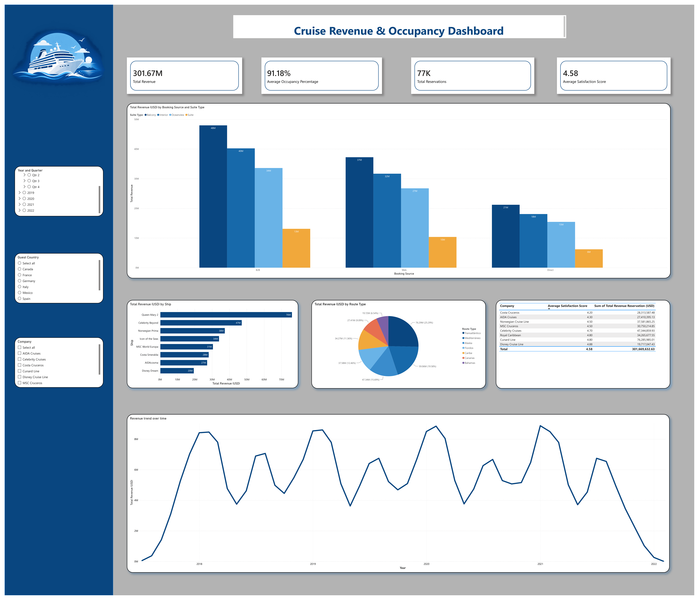

# Task 3 - Data Visualization

## Cruise Revenue Dashboard

This project focuses on analyzing and visualizing cruise revenue data using **Microsoft Power BI**. An interactive dashboard was created to present key revenue and reservation metrics and provide a clear overview of the data.

## Dashboard

The dashboard includes key metrics and visualizations related to:

* Total Revenue
* Total Reservations
* Revenue by Cruise
* Revenue by Cabin Type
* Revenue by Ship
* Revenue and reservation trends
* Other relevant business metrics

## Data Preparation

The dataset was already clean and did not require data cleaning or transformation. Column names were renamed to make them clearer and easier to understand when working with the dashboard.

## Tools & Technologies

* **Microsoft Power BI**
* **DAX** – calculated measures and KPIs
* **CSV** – source dataset

## Project Structure

```text
Task 3 - Data Vizualization/
│
├── Cruise Revenue Dashboard.pbix
├── README.md
└── screenshots/
```

## Dashboard Preview



## Objective

The objective of this task is to create an interactive Power BI dashboard that presents cruise revenue data in a clear and visually understandable way.

## Skills Demonstrated

* Data visualization
* Power BI dashboard development
* DAX measures
* KPI creation
* Dashboard design
* Business data analysis

## Dataset

The dataset used for this project is publicly available online.

**Source:** https://www.kaggle.com/datasets/andresrivasamil/report-cruises-revenue-management

The dataset contains cruise revenue and reservation-related information used to create the dashboard.

